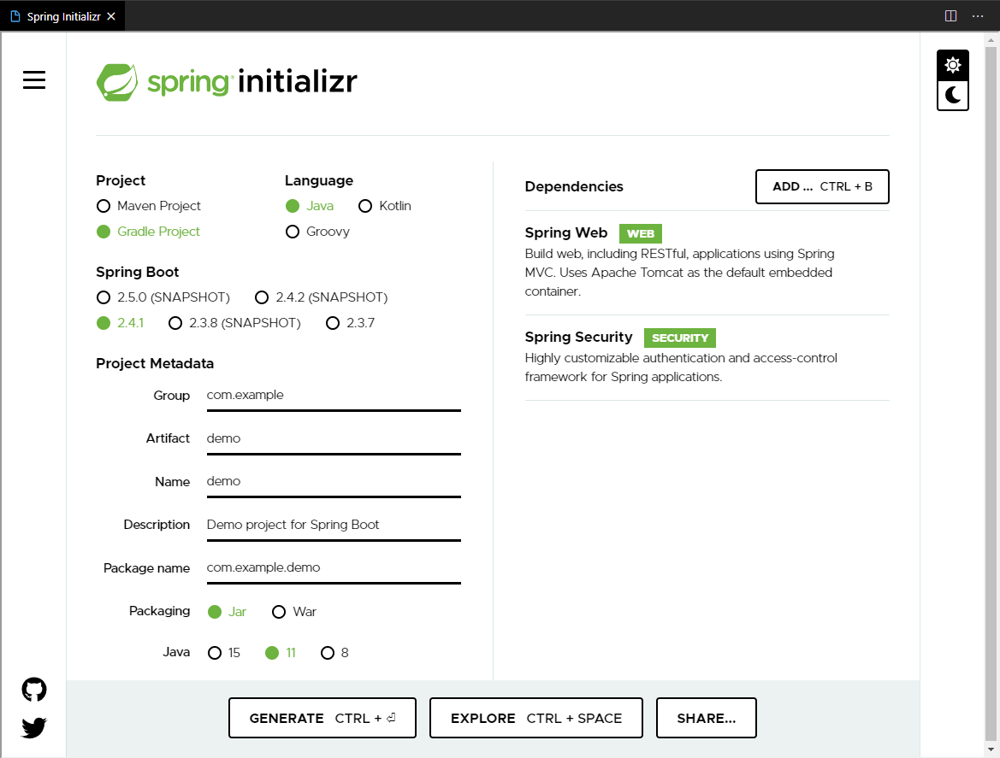

# Spring Initializr in VSCode

Open [Spring Initializr](https://start.spring.io/) in VSCode
## What is new

- Extract the generated project and open it in a new VSCode window.
- Configure the default folder for extracting the generated projects.



**TIP:** To open the links in Spring Initializr in the desktop browser simply ```CTRL-Click``` the links.
